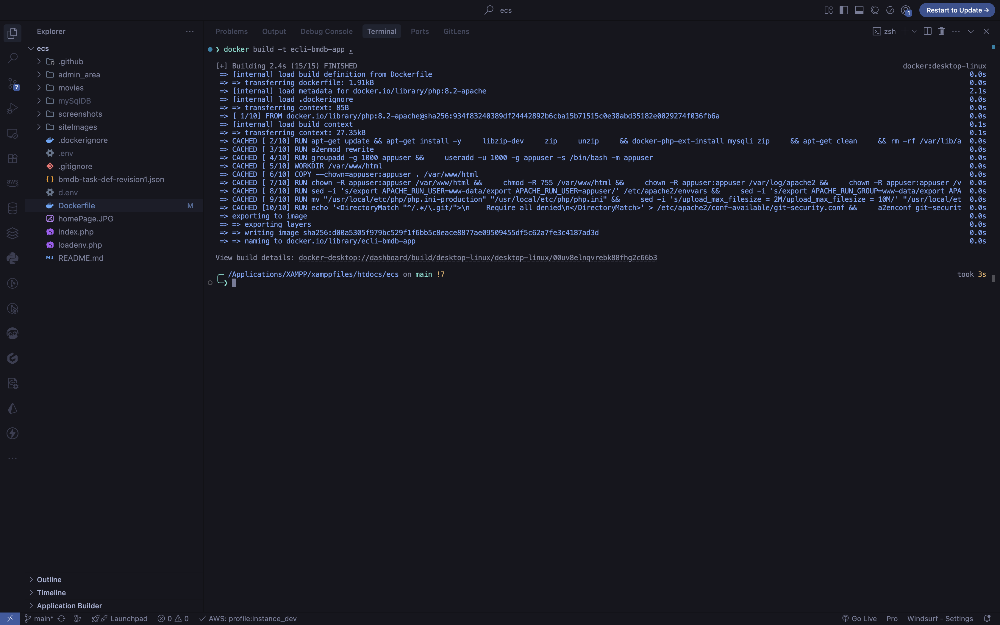
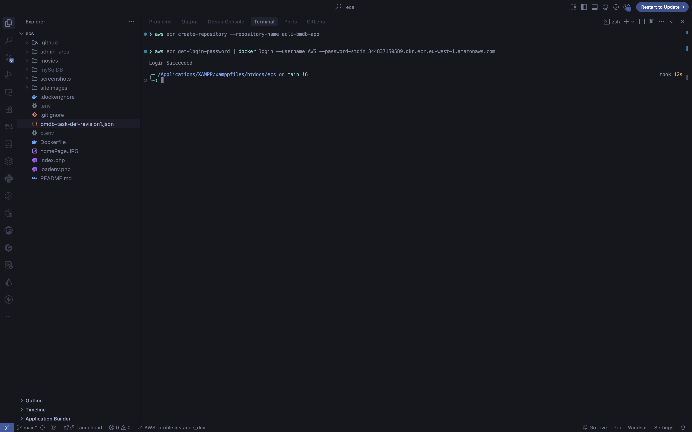
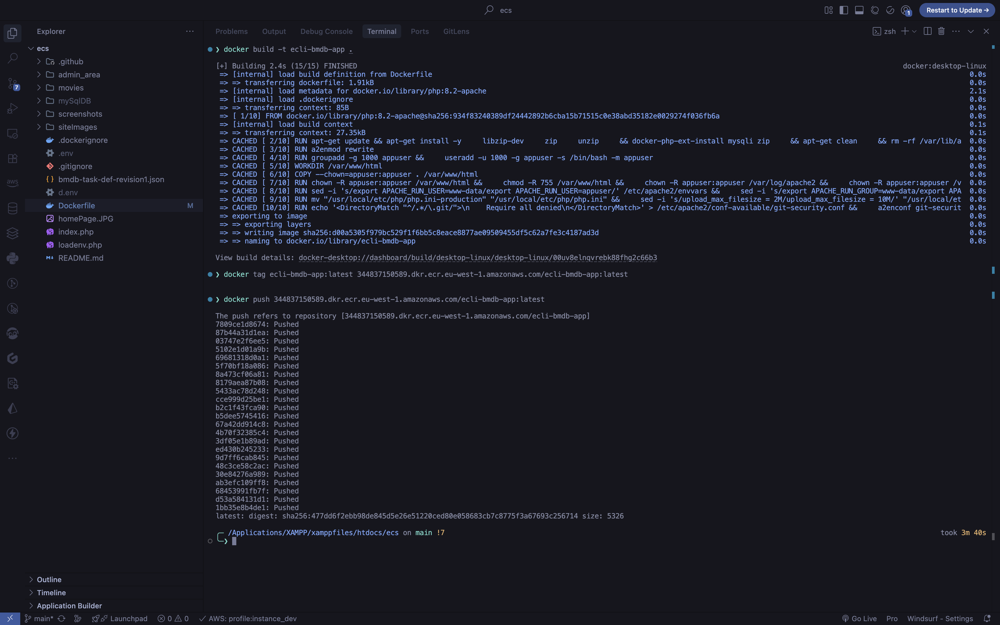
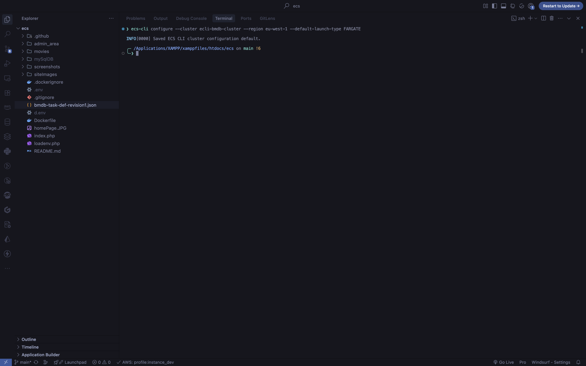
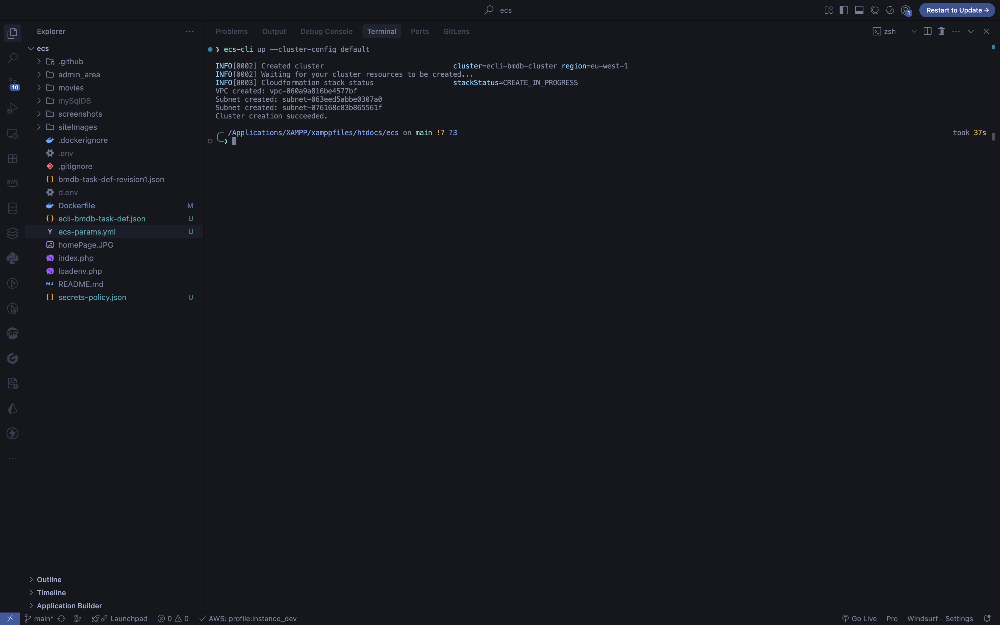
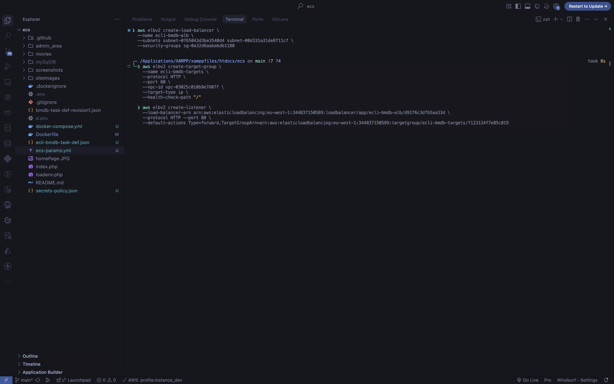
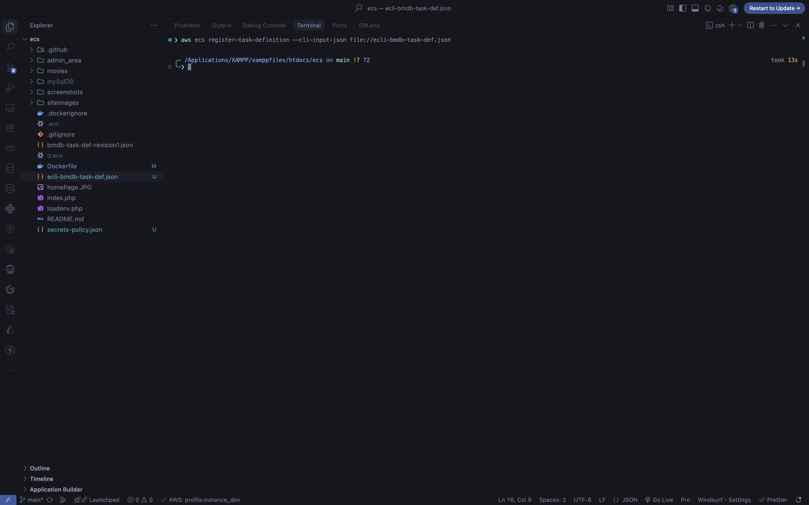
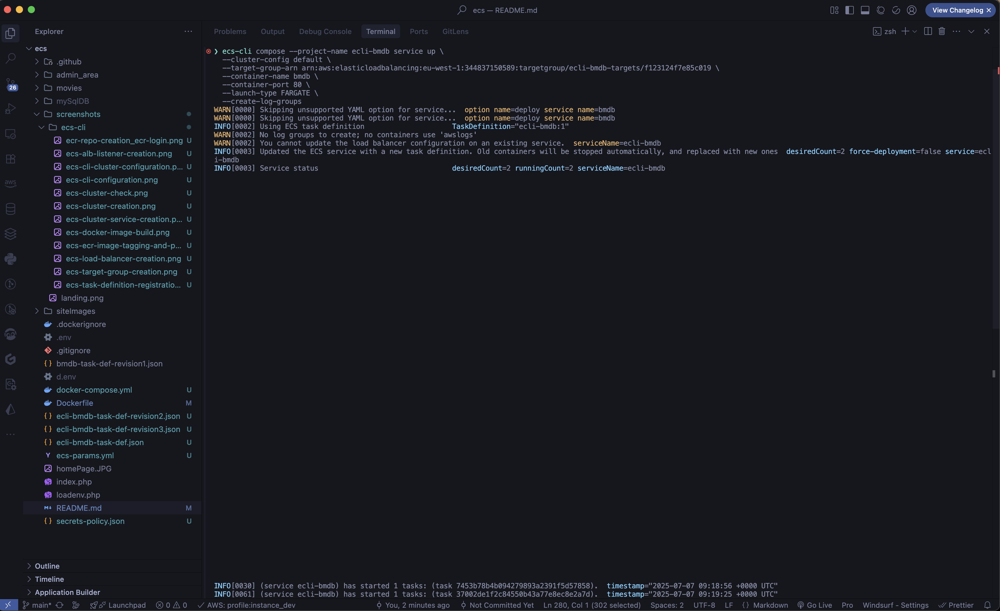

# BMDB - Movie Database Application AWS ECS Deployment

## Project Overview

In this lab, I've deployed my PHP-based movie database application (BMDB) to AWS ECS using Fargate. This README documents my deployment process and the challenges I encountered along the way.

The application allows users to browse and stream movies categorized by genre, director, year, and country. It connects to a MySQL database hosted on AWS RDS for data storage.

**Live Application:** [http://ecli-bmdb-alb-1183601848.eu-west-1.elb.amazonaws.com](http://ecli-bmdb-alb-1183601848.eu-west-1.elb.amazonaws.com)


## Deployment Architecture

My deployment uses the following AWS services:

- **ECS with Fargate** - For container orchestration without managing servers
- **ECR** - For storing my Docker image
- **Secrets Manager** - For securely managing database credentials
- **Application Load Balancer** - For distributing traffic to my containers
- **CloudWatch** - For logging and monitoring
- **IAM** - For security and permissions

## Step 1: Containerizing the Application

First, I created a production-ready Dockerfile that includes:

- PHP 8.2 with Apache
- Required PHP extensions (mysqli, zip)
- Production PHP configuration
- Security hardening
- OPCache optimization

```dockerfile
FROM php:8.2-apache

# Install system dependencies and PHP extensions
RUN apt-get update && apt-get install -y \
    libzip-dev \
    zip \
    unzip \
    && docker-php-ext-install mysqli zip \
    && apt-get clean \
    && rm -rf /var/lib/apt/lists/*

# Configure Apache
RUN a2enmod rewrite

# Create a non-root user to run the application
RUN groupadd -g 1000 appuser && \
    useradd -u 1000 -g appuser -s /bin/bash -m appuser

# Set up the application
WORKDIR /var/www/html

# Copy application files with correct ownership
COPY --chown=appuser:appuser . /var/www/html

# Set proper permissions
RUN chown -R appuser:appuser /var/www/html && \
    chmod -R 755 /var/www/html && \
    chown -R appuser:appuser /var/log/apache2 && \
    chown -R appuser:appuser /var/run/apache2

# Update Apache configuration to run as the non-root user
RUN sed -i 's/export APACHE_RUN_USER=www-data/export APACHE_RUN_USER=appuser/' /etc/apache2/envvars && \
    sed -i 's/export APACHE_RUN_GROUP=www-data/export APACHE_RUN_GROUP=appuser/' /etc/apache2/envvars

# Configure PHP for production
RUN mv "$PHP_INI_DIR/php.ini-production" "$PHP_INI_DIR/php.ini" && \
    sed -i 's/upload_max_filesize = 2M/upload_max_filesize = 10M/' "$PHP_INI_DIR/php.ini" && \
    sed -i 's/post_max_size = 8M/post_max_size = 10M/' "$PHP_INI_DIR/php.ini" && \
    sed -i 's/memory_limit = 128M/memory_limit = 256M/' "$PHP_INI_DIR/php.ini"

# Set environment variables
ENV APACHE_DOCUMENT_ROOT=/var/www/html
ENV PHP_OPCACHE_ENABLE=1
ENV PHP_OPCACHE_VALIDATE_TIMESTAMPS=0

# Security: Disable access to .git directories
RUN echo '<DirectoryMatch "^/.*/\.git/">\n\
    Require all denied\n\
</DirectoryMatch>' > /etc/apache2/conf-available/git-security.conf && \
    a2enconf git-security

EXPOSE 80

# Switch to the non-root user
USER appuser

CMD ["apache2-foreground"]

```

After building my container, I tested it locally to ensure everything worked correctly.

- Docker Build
  

## Step 2: Pushing to Amazon ECR

I created an ECR repository and pushed my Docker image:

```bash
# Create ECR repository
aws ecr create-repository --repository-name ecli-bmdb-app

# Login to ECR
aws ecr get-login-password | docker login --username AWS --password-stdin 344837150589.dkr.ecr.eu-west-1.amazonaws.com

# Tag and push image
docker tag bmdb:latest 344837150589.dkr.ecr.eu-west-1.amazonaws.com/ecli-bmdb-app:latest
docker push 344837150589.dkr.ecr.eu-west-1.amazonaws.com/ecli-bmdb-app:latest
```

- ECR creation and login
  

- tag and push image
  

## Step 3: Setting Up AWS Secrets Manager

To keep my database credentials secure, I stored them in AWS Secrets Manager:

```bash
aws secretsmanager create-secret \
  --name ecli-bmdb/database-credentials \
  --description "Database credentials for BMDB app" \
  --secret-string '{"DATABASE_HOST":"","DATABASE_USER":"","DATABASE_PASSWORD":"","DATABASE_NAME":""}'
```

I then created an IAM policy to allow my ECS task to access these secrets:

```json
{
  "Version": "2012-10-17",
  "Statement": [
    {
      "Effect": "Allow",
      "Action": "secretsmanager:GetSecretValue",
      "Resource": "arn:aws:secretsmanager:eu-west-1:344837150589:secret:ecli-bmdb/database-credentials-Q38t86"
    }
  ]
}
```

## Step 4: Creating the ECS Cluster

I used the ECS CLI to configure and create my cluster:

```bash
# Configure ECS CLI
ecs-cli configure --cluster ecli-bmdb-cluster --region eu-west-1 --default-launch-type FARGATE

# Create ECS cluster
ecs-cli up --cluster-config default
```

- cluster configuration
  
- cluster creation
  

## Step 5: Set Up Load Balancer and Target Group

I setup the load balancer and target group using the AWS CLI:

```bash
# Create ALB
aws elbv2 create-load-balancer \
  --name ecli-bmdb-alb \
  --subnets subnet-0765043d3be3540d4 subnet-00d331a31de8f11cf \
  --security-groups sg-06a7b17a17df8da31

# Create target group
aws elbv2 create-target-group \
  --name ecli-bmdb-targets \
  --protocol HTTP \
  --port 80 \
  --vpc-id vpc-05e7e639b07ba53c1 \
  --target-type ip \
  --health-check-path "/"

# Create listener
aws elbv2 create-listener \
  --load-balancer-arn arn:aws:elasticloadbalancing:eu-west-1:344837150589:loadbalancer/app/ecli-bmdb-alb/d9176c3dfb5aa33d \
  --protocol HTTP --port 80 \
  --default-actions Type=forward,TargetGroupArn=arn:aws:elasticloadbalancing:eu-west-1:344837150589:targetgroup/ecli-bmdb-targets/f123124f7e85c019
```



## Step 6: Create CloudWatch log group (critical step! I forgot this and my tasks were failing)

aws logs create-log-group --log-group-name /ecs/ecli-bmdb

## Step 7: Creating the Task Definition

I created a task definition that includes my container configuration and securely references the database credentials from Secrets Manager:

```json
{
  "family": "ecli-bmdb",
  "executionRoleArn": "arn:aws:iam::344837150589:role/ecsTaskExecutionRole",
  "networkMode": "awsvpc",
  "containerDefinitions": [
    {
      "name": "bmdb",
      "image": "344837150589.dkr.ecr.eu-west-1.amazonaws.com/ecli-bmdb-app:latest",
      "essential": true,
      "portMappings": [
        {
          "containerPort": 80,
          "hostPort": 80,
          "protocol": "tcp"
        }
      ],
      "secrets": [
        {
          "name": "DATABASE_HOST",
          "valueFrom": "arn:aws:secretsmanager:eu-west-1:344837150589:secret:ecli-bmdb/database-credentials-Q38t86:DATABASE_HOST::"
        },
        {
          "name": "DATABASE_USER",
          "valueFrom": "arn:aws:secretsmanager:eu-west-1:344837150589:secret:ecli-bmdb/database-credentials-Q38t86:DATABASE_USER::"
        },
        {
          "name": "DATABASE_PASSWORD",
          "valueFrom": "arn:aws:secretsmanager:eu-west-1:344837150589:secret:ecli-bmdb/database-credentials-Q38t86:DATABASE_PASSWORD::"
        },
        {
          "name": "DATABASE_NAME",
          "valueFrom": "arn:aws:secretsmanager:eu-west-1:344837150589:secret:ecli-bmdb/database-credentials-Q38t86:DATABASE_NAME::"
        }
      ],
      "user": "root",
      "logConfiguration": {
        "logDriver": "awslogs",
        "options": {
          "awslogs-group": "/ecs/ecli-bmdb",
          "awslogs-region": "eu-west-1",
          "awslogs-stream-prefix": "ecs"
        }
      }
    }
  ],
  "requiresCompatibilities": ["FARGATE"],
  "cpu": "256",
  "memory": "512"
}
```

This was registered using:

```bash
aws ecs register-task-definition --cli-input-json file://ecli-bmdb-task-def-revision3.json
```



## Step 9: Deploying the Service

I created a simple docker-compose.yml file for use with the ECS CLI:

```yaml
version: "3"
services:
  bmdb:
    image: 344837150589.dkr.ecr.eu-west-1.amazonaws.com/ecli-bmdb-app:latest
    ports:
      - "80:80"
    deploy:
      replicas: 2
```

# Create ECS service with load balancer

```bash
ecs-cli compose --project-name ecli-bmdb service up \
  --cluster-config default \
  --target-group-arn arn:aws:elasticloadbalancing:eu-west-1:344837150589:targetgroup/ecli-bmdb-targets/f123124f7e85c019 \
  --container-name bmdb \
  --container-port 80 \
  --launch-type FARGATE \
  --create-log-groups
```



## Step 8: Scaling the Service

I scaled my service to have 2 running tasks for better availability:

```bash
aws ecs update-service --cluster ecli-bmdb-cluster --service ecli-bmdb --task-definition ecli-bmdb:3 --desired-count 2 --force-new-deployment
```

## Challenges and Solutions

During this deployment, I encountered several challenges:

1. **Non-root User Issues**: Initially, I tried to run the container as a non-root user (`appuser`) for better security, but encountered permission issues with Apache binding to port 80. Since Fargate doesn't support the `NET_BIND_SERVICE` capability, I had to revert to using `root` in the task definition and run a service update to apply the changes using :

```bash
aws ecs update-service --cluster ecli-bmdb-cluster --service ecli-bmdb --task-definition ecli-bmdb:3 --force-new-deployment
```

2. **Missing CloudWatch Log Group**: My tasks were failing because the CloudWatch log group didn't exist. I fixed this by creating the log group before deployment.

3. **Secrets Access**: I had to ensure the task execution role had the correct permissions to access secrets in AWS Secrets Manager.

4. **Service Deployment**: The ECS CLI doesn't support the `deploy` section in docker-compose.yml, so I had to use the AWS CLI to manage scaling.

## Monitoring the Deployment

I used these commands to monitor my deployment:

```bash
# View running tasks
ecs-cli compose --project-name ecli-bmdb service ps --cluster-config default

# Check CloudWatch logs
aws logs get-log-events --log-group-name /ecs/ecli-bmdb --log-stream-name ecs/bmdb/cf4f6e831ad648b19ed1d4e0931ef88a
```

## Conclusion

My PHP movie database application is now successfully deployed on AWS ECS with Fargate, behind a load balancer, and connecting securely to an RDS database using credentials from AWS Secrets Manager. The service is scaled to 2 tasks for better availability.

**Live Application URL:** http://ecli-bmdb-alb-1183601848.eu-west-1.elb.amazonaws.com

## Next Steps

In future iterations, I plan to:

1. Add HTTPS support with an SSL certificate
2. Configure auto-scaling based on traffic patterns
3. Set up a CI/CD pipeline for automated deployments
4. Implement enhanced monitoring and alerting
